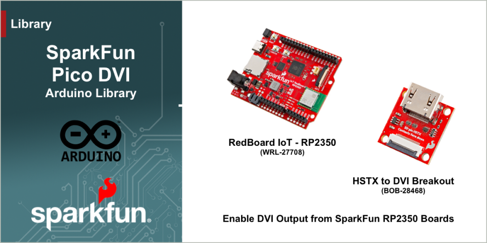

# SparkFun PicoDVI Arduino Library

Arduino Library for generating DVI output from HSTX enabled SparkFun RP2350 boards.

The SparkFun Pico DVI library is used to generating DVI output via the Raspberry Pi RP2350 HSTX capability. Designed for use with the [SparkFun RedBoard IoT - RP2350](https://www.sparkfun.com/sparkfun-iot-redboard-rp2350.html) working with the [SparkFun HSTX to DVI Breakout](https://www.sparkfun.com/sparkfun-hstx-to-dvi-breakout.html), this library enables DVI output for display.

This library is a simple sub-class/wrapper around the [Adafruit Pico DVI library](https://github.com/adafruit/PicoDVI), which itself is based on the [PicoDVI](https://github.com/Wren6991/PicoDVI) library. All this library provides is the configuration settings to use for the SparkFun IoT RedBoard - RP2350.

For implementation details and source code, consult the [Adafruit Pico DVI library](https://github.com/adafruit/PicoDVI)

## Functionality

Enables DVI Output for the SparkFun IoT RedBoard - RP2350.

## Documentation

|Reference | Description |
|---|---|
|[SparkFun HSTX to DVI Breakout](https://github.com/sparkfun/SparkFun_HSTX_to_DVI_Breakout)| Hardware GitHub Repository|

## License Information

This product is ***open source***!

This product is licensed using the [MIT Open Source License](https://opensource.org/license/mit).
